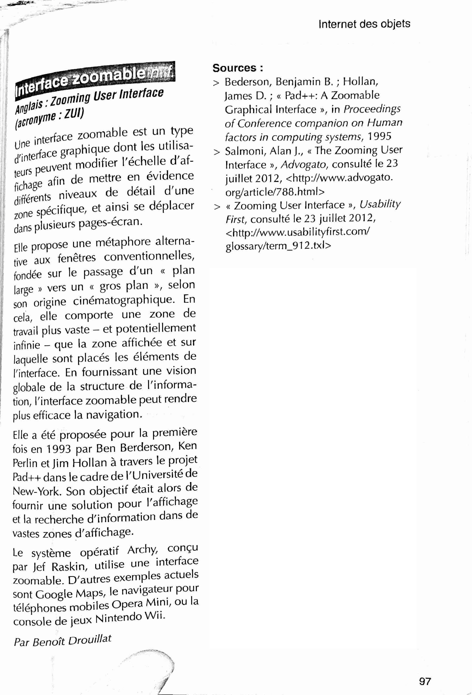

# 4UX - S1 conception et prototypage
- 8/01/2021 - 3h
- 20/01/2021 - 3h
- 25/01/2021 - 4h30
- 27/01/2021 - 3h
- 05/02/2021 - 3h

---

## Les interfaces graphiques non conventionnelles

[Ressources en ligne sur les interfaces](https://www.are.na/nicolas-tilly/interfaces-o4ycuz-pqsm)

**Sujet : Zooming User Interface (ZUI) - Interface zoomable**

Une interface zoomable est un type d'interface dont les utilisateurs peuvent modifier l'échelle d'affichage afin de mettre en évidence différents niveaux de détail d'une zone spécifique, et ainsi se déplacer dans plusieurs pages-écran.

[Pad++: A Zooming User Interface (1998)](https://www.youtube.com/watch?v=BlIRYTuSv0Q)

[Pad++: A Zooming Graphical Interface
for Exploring Alternate Interface Physics](http://citeseerx.ist.psu.edu/viewdoc/download?doi=10.1.1.295.5863&rep=rep1&type=pdf)

### Méthodologie et organisation :

Concevoir une **expérience via une interface zoomable** (ZUI) qui met en avant une ressource d’images libres (une à choisir entre les deux) :

- [ClipArt ETC](https://etc.usf.edu/clipart/)
- [Internet Archive Book Images](https://www.flickr.com/photos/internetarchivebookimages)

Étapes de réalisation du projet :

- Usages
- scénario
- choix images
- Interface ZUI
- maquette
- prototype

---

## Exemples et solutions pour prototyper 

Il faut distinguer **deux solutions** pour prototyper vos projets, l'une au format vidéo et l'autre interactive sur le Web. 

- La vidéo qui va présenter principalement des animations. Cette solution est passive, le format finale étant une vidéo à regarder. Il est possible d'ajouter du son et de la musique.
- Des solutions plus interactives avec Figma ou Adobe XD par exemple, mais cela peut être limité/trop simple dans les interactions et animations.
- Enfin, le Web qui permet de construire des prototypes interactifs poussés, mais cela demande de programmer le projet (js, css, html).

## 1 - Vidéo/3D avec Blender (vidéo)

- [Pan & zoom in Blender](https://www.youtube.com/watch?v=SNEERJs1dsk)
- [Controler la caméra dans Blender](https://www.youtube.com/watch?v=GTUwmTunjtM)

## 2 - After Effects (vidéo)

- [3D camera tool in AE](https://www.youtube.com/watch?v=Axa38beTBvo)

## 3 - Web (interaction)

- [Zoomoz.js](http://jaukia.github.io/zoomooz/)
- [zoom.js](https://lab.hakim.se/zoom-js/)
- [Jquery Zoom](https://www.jacklmoore.com/zoom/)
- [3D models on the web](https://modelviewer.dev/)
- [Un exemple de zoom tactile sur mobile](https://glitch.com/edit/#!/edition-mobile-4?path=index.html%3A1%3A0)
- [Loupe sur une image](https://codepen.io/nicolastilly/pen/jJyOqY)
