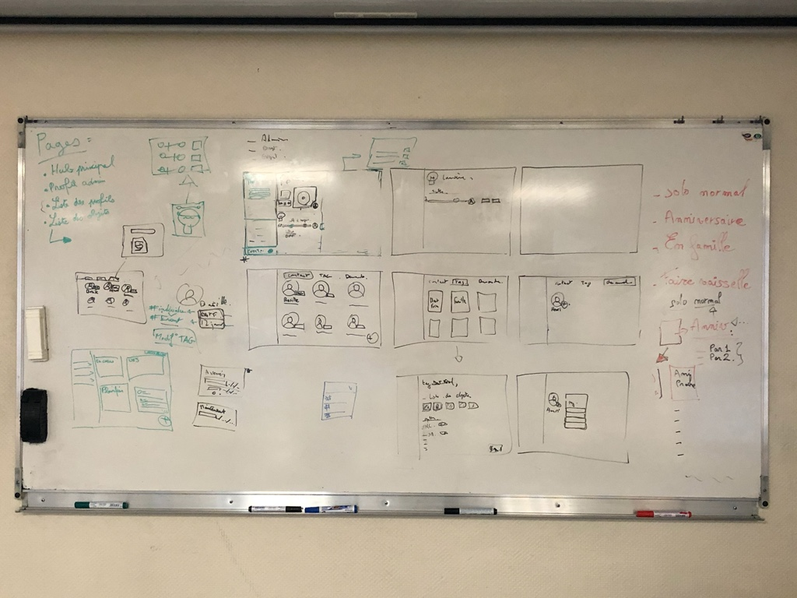
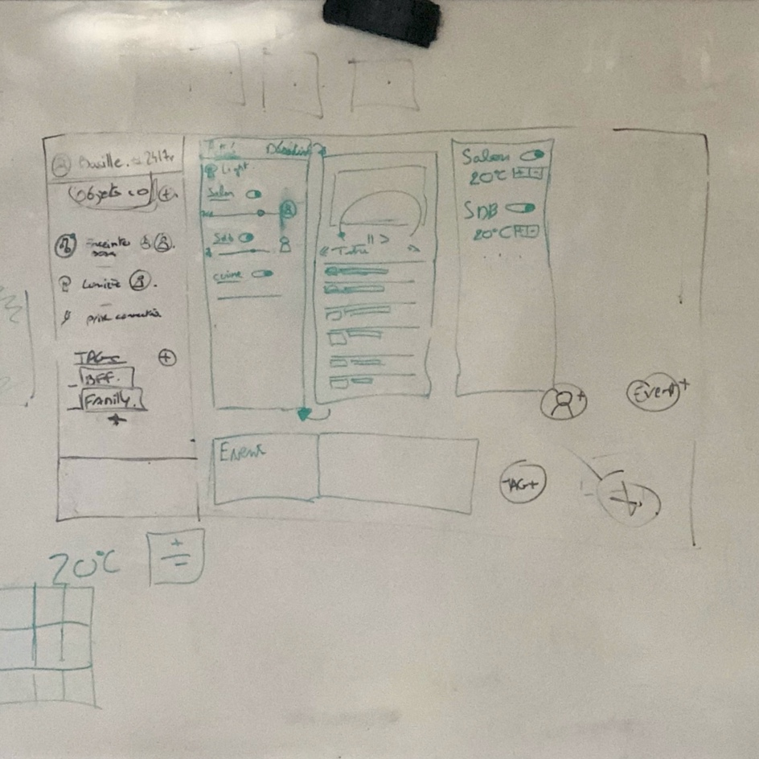

# Domotique 2019-2020

---

Projet : un hub des objets connectés dans la maison. L'appli permet de partager un éco-système connecté avec d'autres utilisateurs.

L'administrateur donne des accès à des utilisateurs en fonction de différents profils (famille, invités, locataire...).

Devices possibles :
- code wifi
- enceinte connectée
- TV
- thermostat
- Prise connectée
- électroménager

Possibilité de partager des informations sur l'utilisation des devices vers l'administrateur.

Exemple de l'enceinte connectée : les utilisateurs peuvent avoir accès à des réglages comme le volume, l'allumage et le choix des musiques en fonction des différents droits accordés dans leurs profils.

**Avancement du projet du 8/01/2020** :

Détail des écrans et du scénario. Page d'accueil et déroulé de la page de gestion des profils (ajouter un profil et lui relier un ou des tags, assigner des fonctionnalités liées aux devices).

## Pour l'application iPad

**Contenus :**

- Layout Grid
- Images

**Components :**

- Badge (pour les tags)
- Buttons
- Card
- List
- Nav
- Tabs
- Date picker
- Toggle
- Modal
- Slider
- Round slider
- Search bar
- Modal
- Forms

---

Outils tech possibles :

- [Figma](https://www.figma.com/)
- [La communication en champ proche NFC](<https://fr.wikipedia.org/wiki/Communication_en_champ_proche>)
- [Material Angular js](https://material.angularjs.org/latest/)
- [Bootstrap](https://getbootstrap.com/)
- [Components Bootstrap](https://getbootstrap.com/docs/4.4/components/alerts/)
- [Material Design iOS](https://material.io/collections/developer-tutorials/#ios-swift)
- [Components guidelines](https://material.io/components/)

Références :

- [HomeKit](https://www.apple.com/fr/ios/home/) 
- Slack
- Discord
- [Channel arena Interfaces](https://www.are.na/nicolas-tilly/interfaces-o4ycuz-pqsm)